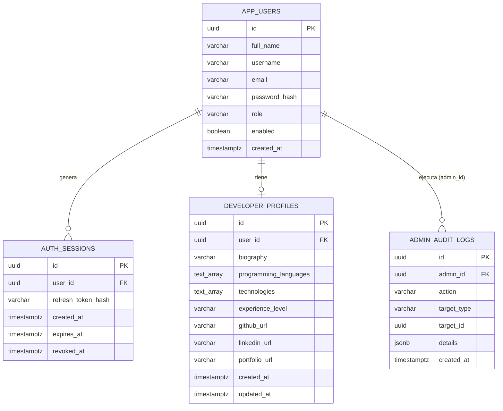

# DevConnect — Diseño de Base de Datos (Sprint 1)

**Fábrica Escuela 2026-2 · Facultad de Ingeniería · Rol: Bases de Datos**

> Documentación del modelo de datos correspondiente al Sprint 1 del proyecto
> DevConnect (red social para desarrolladores). Este repositorio documenta el
> esquema realmente implementado en el backend del proyecto conjunto, a partir
> de las migraciones Flyway (`V1` a `V7`) del repositorio principal.

Repositorio del proyecto (backend/frontend): https://github.com/TheMax1270/EAV02-Fabrica-Escuela

## Contenido de este repositorio

- [`schema.sql`](./schema.sql) — script DDL del modelo físico, ejecutable en PostgreSQL / Supabase.
- [`queries.sql`](./queries.sql) — consultas SQL que resuelven las preguntas de negocio del punto 2.
- Este `README.md` — entidades y relaciones, preguntas clave, modelo lógico y modelo físico.

## Alcance del Sprint 1 (rol Bases de Datos)

Este sprint documenta las cuatro tablas que soportan las historias de usuario
que el backend tiene implementadas:

| Historia de usuario | Tabla(s) asociada(s) |
|---|---|
| HU-01 — Registro de usuario | `users.app_users` |
| HU-03 — Inicio de sesión | `users.app_users`, `authentication.auth_sessions` |
| HU-05 — Crear/editar perfil técnico | `profiles.developer_profiles` |
| HU-08 — Gestionar usuarios (listar, suspender, reactivar) | `users.app_users`, `admin.audit_logs` |
| HU-09 — Auditoría de acciones administrativas | `admin.audit_logs` |

> Nota: HU-02 (verificación de correo), HU-04 (recuperar contraseña) y
> HU-21 (login con Google) están definidas a nivel de producto pero aún no
> tienen soporte de datos en el backend (no existen columnas de token de
> verificación, estado "pendiente de verificación", tabla de recuperación de
> contraseña, ni `provider`/`google_id`). Quedan fuera del alcance de este
> entregable porque el objetivo es documentar el modelo *tal como existe hoy*.
> De HU-08 tampoco se cubren la eliminación física de cuentas ni las
> políticas de contraseña (fuera del MVP).

## Organización en schemas

Desde la migración `V7`, la base de datos deja de usar únicamente `public` y
se organiza en **un schema por módulo del backend**. En `public` solo
permanece `flyway_schema_history` (tabla de control de Flyway).

| Módulo backend | Schema | Tablas |
|---|---|---|
| `user` | `users` | `app_users` |
| `auth` | `authentication` | `auth_sessions` |
| `profile` | `profiles` | `developer_profiles` |
| `admin` | `admin` | `audit_logs` |

Convenciones adoptadas:

- Nombre de dominio en plural, sin prefijo. Se evitan `auth` (schema
  reservado por Supabase Auth) y `user` (palabra reservada en SQL).
- Toda referencia a una tabla se escribe calificada (`users.app_users`),
  tanto en SQL como en las entidades JPA (`@Table(schema = ...)`).
- Los schemas futuros seguirán la misma regla (`projects`, `posts`,
  `interactions`, `messaging`, `notifications`).

La reorganización se hizo con `ALTER TABLE ... SET SCHEMA`, que solo cambia
el namespace de la tabla: datos, índices, restricciones y claves foráneas se
conservan intactos.

## 1. Entidades y relaciones



**Descripción de entidades**

- **`users.app_users`**: cuenta de cada usuario de la plataforma. El campo
  `role` distingue entre `DEVELOPER` y `ADMIN` (no hay tabla de roles
  separada; es un valor controlado por `CHECK`). `email` y `username` son
  únicos de forma case-insensitive (índices sobre `lower(...)`). El campo
  `enabled` representa el **estado de la cuenta**: `true` = activa, `false` =
  suspendida por un administrador; una cuenta suspendida no puede iniciar
  sesión ni usar sus sesiones existentes.
- **`authentication.auth_sessions`**: registra cada sesión (refresh token)
  emitida al iniciar sesión. Relación **1 a N** con `app_users`: un usuario
  puede tener varias sesiones activas (por ejemplo, en distintos
  dispositivos).
- **`profiles.developer_profiles`**: perfil técnico opcional de un usuario.
  Relación **1 a 1** con `app_users` (`user_id` es `UNIQUE`): un usuario
  tiene, como máximo, un perfil técnico.
- **`admin.audit_logs`**: bitácora de acciones administrativas. Cada fila
  registra **quién** (`admin_id`, FK a `app_users`), **qué** (`action`, hoy
  `USER_SUSPENDED` o `USER_REACTIVATED`), **sobre qué** (`target_type` +
  `target_id`) y **cuándo** (`created_at`). Relación **1 a N** con
  `app_users` a través de `admin_id`. La pareja `target_type`/`target_id` es
  una referencia *polimórfica*: hoy solo apunta a usuarios (`'USER'`), pero
  está pensada para registrar también moderación de publicaciones,
  comentarios o reportes en sprints posteriores, por eso no lleva FK. La
  columna `details` (`jsonb`) guarda contexto adicional de la acción, por
  ejemplo `{"previousStatus": "ACTIVE", "newStatus": "SUSPENDED"}`.

## 2. Preguntas de negocio clave

1. ¿Cuántos usuarios hay registrados por rol (`DEVELOPER` vs `ADMIN`)?
2. ¿Qué usuarios tienen la cuenta suspendida (`enabled = false`)?
3. ¿Cuáles son las sesiones activas (no revocadas y no expiradas) de un
   usuario específico?
4. ¿Qué desarrolladores de nivel `SENIOR` dominan un lenguaje de programación
   determinado (por ejemplo, `Java`)?
5. ¿Cuántos perfiles técnicos existen por nivel de experiencia
   (`JUNIOR`, `SEMI_SENIOR`, `SENIOR`)?
6. ¿Cuál es el usuario con más sesiones generadas históricamente (posible
   señal de uso frecuente o de abuso de tokens)?
7. ¿Cuál es el historial de acciones administrativas (suspensiones y
   reactivaciones) sobre un usuario específico, y qué administrador ejecutó
   cada una?
8. ¿Cuántas suspensiones y reactivaciones ha ejecutado cada administrador?
9. ¿Qué cuentas están suspendidas actualmente, desde cuándo y quién las
   suspendió?
10. ¿Qué acciones administrativas se realizaron en los últimos 7 días?

Las consultas SQL que resuelven cada pregunta están en
[`queries.sql`](./queries.sql).

## 3. Modelo lógico

| Tabla | Columna | Tipo | Restricciones |
|---|---|---|---|
| `users.app_users` | `id` | uuid | PK |
| | `full_name` | varchar(150) | NOT NULL |
| | `username` | varchar(50) | NOT NULL, único (case-insensitive) |
| | `email` | varchar(254) | NOT NULL, único (case-insensitive) |
| | `password_hash` | varchar(255) | NOT NULL |
| | `role` | varchar(30) | NOT NULL, CHECK IN ('DEVELOPER','ADMIN') |
| | `enabled` | boolean | NOT NULL (`true` activa, `false` suspendida) |
| | `created_at` | timestamptz | NOT NULL |
| `authentication.auth_sessions` | `id` | uuid | PK |
| | `user_id` | uuid | NOT NULL, FK → `users.app_users(id)` |
| | `refresh_token_hash` | varchar(64) | NOT NULL, único |
| | `created_at` | timestamptz | NOT NULL |
| | `expires_at` | timestamptz | NOT NULL, CHECK > created_at |
| | `revoked_at` | timestamptz | nullable |
| `profiles.developer_profiles` | `id` | uuid | PK |
| | `user_id` | uuid | NOT NULL, FK único → `users.app_users(id)` |
| | `biography` | varchar(500) | NOT NULL |
| | `programming_languages` | text[] | NOT NULL |
| | `technologies` | text[] | NOT NULL |
| | `experience_level` | varchar(20) | NOT NULL, CHECK IN ('JUNIOR','SEMI_SENIOR','SENIOR') |
| | `github_url` / `linkedin_url` / `portfolio_url` | varchar(500) | nullable |
| | `created_at` / `updated_at` | timestamptz | NOT NULL, CHECK updated_at >= created_at |
| `admin.audit_logs` | `id` | uuid | PK |
| | `admin_id` | uuid | NOT NULL, FK → `users.app_users(id)` |
| | `action` | varchar(100) | NOT NULL (`USER_SUSPENDED`, `USER_REACTIVATED`) |
| | `target_type` | varchar(50) | NOT NULL (`USER`) |
| | `target_id` | uuid | NOT NULL, sin FK (referencia polimórfica) |
| | `details` | jsonb | nullable |
| | `created_at` | timestamptz | NOT NULL |

**Decisiones de diseño en `admin.audit_logs`**

- `target_type` + `target_id` **no** tienen clave foránea: la tabla es
  genérica para cualquier acción administrativa (usuarios hoy; publicaciones,
  comentarios y reportes en los sprints de moderación). Una FK a `app_users`
  impediría reutilizarla. El índice compuesto `(target_type, target_id)`
  mantiene eficientes las búsquedas por objetivo.
- `admin_id` **sí** tiene FK, pero **sin** `ON DELETE CASCADE`: la
  trazabilidad debe sobrevivir a la cuenta que la generó. Esto también es
  coherente con el alcance de HU-08, donde las cuentas se suspenden en lugar
  de eliminarse precisamente para conservar la trazabilidad.
- `action` se almacena como texto en lugar de `CHECK`/enum para poder
  agregar nuevas acciones sin migraciones de esquema; el dominio se controla
  en la aplicación (enum `AdminAction` del backend).
- `details` es `jsonb` porque su contenido depende de la acción (para una
  suspensión guarda el estado anterior y el nuevo); una columna por cada
  posible dato produciría muchas columnas nulas.

**Normalización**

El modelo cumple 1FN/2FN/3FN para sus claves y dependencias funcionales:
todas las tablas tienen clave primaria propia (`uuid`), no hay dependencias
transitivas (los atributos no clave dependen únicamente de la PK) y las
relaciones se resuelven con claves foráneas explícitas.

Excepción deliberada: `programming_languages` y `technologies` en
`developer_profiles` usan el tipo `text[]` nativo de PostgreSQL en lugar de
tablas de unión (`developer_languages`, `developer_technologies`). Esto
relaja la atomicidad estricta de 1FN a cambio de simplicidad para el MVP del
Sprint 1. Una normalización completa extraería estas colecciones a tablas
relacionadas N:M con `developer_profiles`; se deja como mejora propuesta
para un sprint posterior si el negocio necesita filtrar/agregar por
lenguaje o tecnología de forma más eficiente que con operadores de array.

## 4. Modelo físico

El script completo está en [`schema.sql`](./schema.sql). Incluye:

- Creación de los cuatro schemas (`users`, `authentication`, `profiles`,
  `admin`) y todas las tablas calificadas con su schema.
- Tipos de datos específicos por columna (no genéricos), incluido `jsonb`
  para datos semiestructurados en `admin.audit_logs.details`.
- Claves primarias (`uuid`) y foráneas (`REFERENCES`) explícitas.
- Restricciones `NOT NULL`, `UNIQUE` y `CHECK` (dominio de `role` y de
  `experience_level`, coherencia de fechas en `auth_sessions` y
  `developer_profiles`).
- Índices: únicos case-insensitive en `app_users(email)` y
  `app_users(username)`; índices simples en las columnas usadas para
  búsquedas frecuentes (`user_id`, `expires_at`); en `admin.audit_logs`,
  índices por administrador (`admin_id`), por objetivo
  (`target_type, target_id`) y por fecha descendente (`created_at DESC`)
  para las consultas de bitácora reciente.

### Cómo ejecutarlo

```bash
psql "postgresql://<usuario>:<password>@<host>:<puerto>/<basededatos>" -f schema.sql
```

O bien, pegar el contenido de `schema.sql` en el **SQL Editor** de Supabase
y ejecutarlo sobre un proyecto/base vacío.

## 5. Trazabilidad con el backend

Este esquema corresponde 1 a 1 con las migraciones Flyway del repositorio
principal (`backend/src/main/resources/db/migration`):

| Migración | Contenido |
|---|---|
| `V1__create_app_users.sql` | Creación de `app_users` |
| `V2__create_auth_sessions.sql` | Creación de `auth_sessions` |
| `V3__fix_auth_session_refresh_token_type.sql` | Ajuste de tipo de `refresh_token_hash` |
| `V5__recreate_developer_profiles.sql` | Versión vigente de `developer_profiles` (reemplaza a `V4`) |
| `V6__create_admin_audit_logs.sql` | Creación del schema `admin` y de `admin.audit_logs` con sus índices |
| `V7__move_tables_to_domain_schemas.sql` | Creación de `users`, `authentication` y `profiles`; traslado de las tablas existentes con `SET SCHEMA` |

> `schema.sql` refleja el estado **final** tras aplicar `V1`–`V7`: crea las
> tablas directamente en su schema definitivo en lugar de crearlas en
> `public` y moverlas después.
